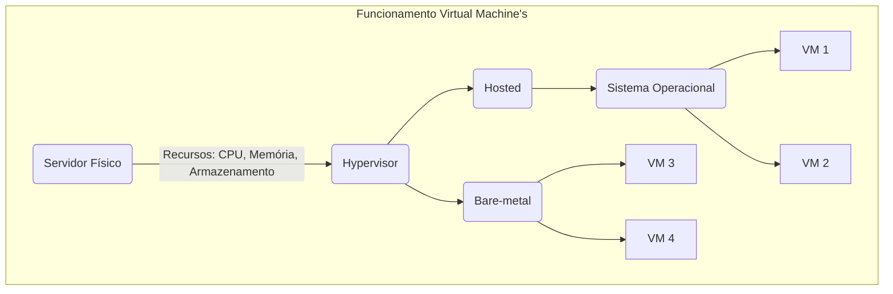
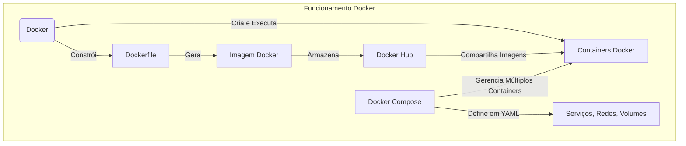
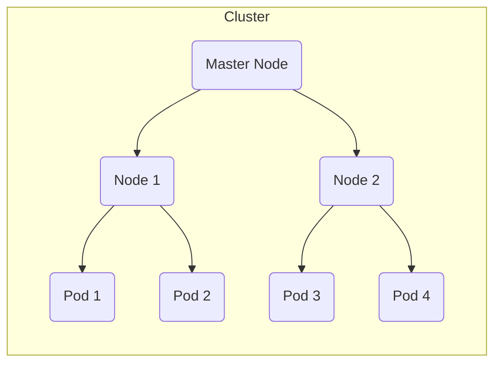

# Relatório de Estudos

**Nome do Estagiário:** Gustavo Monteiro Gomes Pires  
**Data:** 14/08/2024

**Módulos/Etapas Feitas:**  
1. **Mensageria**
2. **Virtualização**
3. **Computação em nuvem**

## Resumo dos módulos 

### Mensageria

**Pub/Sub** é um pattern arquetetural extremamente flexível e escalonável, com comunicação desacoplada e assíncrona, ou seja, comunicação independente sem necessidade de um conhecimento direto sobre o estado ou a disponibilidade dos *publishers* e *subscribers*, utilizado em sistemas de mensageria, monitoramento, sistema de notificações entre outros modelos.

- O *Publisher*, por exemplo a *Waze*, publica uma mensagem de acidente em uma rodovia, o *Message Broker* gerencia as mensagens e certifica que seja entregue ao usuário correto, exemplificando, seria alguém próximo ao acidente ou que esteja se direcionando a essa rodovia(Tópico), o *Subscriber* recebe essa mensagem no seu aplicativo.

**Google Cloud Pub/Sub** tem como principais características a escabilidade automática (ajustando o número de mensagens ao número de assinantes), Modelo Pub/Sub onde produtores de mensagens enviam para tópicos e os consumidores(assinantes) recebem, segurança com a integração do Identity and Access Management (IAM) que permite definir quanto os usuários podem acessar e editar.

### Virtualização

**Máquinas virtuais (VMs)** são emulações de computadores isoladas em um ambiente de software, ou seja, permite executar vários sistemas operacionais e aplicativos em apenas uma máquina física (hardware), compartilhando recursos físicos como CPU e memória. A portabilidade das VMs facilita a movimentação entre servidores, suportando a escalabilidade e recuperação de desastres. O gerenciamento é simplificado e centralizado por hypervisors, que criam e gerenciam as VMs, podendo ser do tipo bare-metal(executa diretamente no hardware do servidor) ou hosted(executa sobre um sistema operacional host). VMs são amplamente utilizadas para consolidar servidores, criar ambientes de desenvolvimento e teste isolados, executar sistemas legados(antigo) em um ambiente moderno e escalar aplicações na nuvem, trazendo eficiência, flexibilidade e segurança aos recursos de TI.



**Docker**

"*É uma plataforma de software que facilita a criação, distribuição e execução de aplicativos dentro de containers. Os containers são ambientes isolados que contêm tudo o que um aplicativo precisa para funcionar, incluindo o código, as bibliotecas e as dependências, garantindo que ele funcione de maneira consistente em diferentes ambientes.*"

Containers Docker são muito utilizados em desenvolvimento e testes pois são ambientes isolados, rápidos e consistentes, ou seja, permite executar múltiplos containers ao mesmo tempo, de maneira rápida porque compartilham o mesmo kernel do computador e são consistentes porque se comportam da mesma maneira em qualquer ambiente/máquina pois utilizam a mesma Imagem Docker, que contêm o mesmo código-fonte, bibliotecas e outras dependências. O Dockerfile é um script com as intruções para a criação da Imagem Docker, DockerHub é um registro público de imagens onde você pode compartilhar ou usar outras imagens, já o Docker Compose gerencia múltiplos containers (Que é o principal desafio ao utilizar o Docker), usando um arquivo YAML para definir serviços, redes e volumes necessários para rodar uma aplicação que utiliza vários containers.



**Kubernetes**

Plataforma de código aberto para orquestração de containers, automatizando o dimensionamento, tanto horizontalmente (adicionando mais instâncias de containers) quanto verticalmente (ajustando os recursos alocados para os containers) e gerenciamento, incluindo a implantação, a atualização, o balanceamento de carga e a recuperação de falhas.



O diagrama acima mostra o exemplo de um cluster. O Master Node coordena o cluster, gerenciando a comunicação e controlando a execução dos Nodes, esses que controlam os Pods. Cada Pod é a menor unidade de implantação e pode conter um ou mais containers que compartilham armazenamento e rede. O Master Node garante que os Nodes e Pods sejam executados de acordo com as definições de Deployment. Dentro do cluster, o ***Service*** é responsável por expor os Pods como serviços de rede, permitindo a comunicação entre eles e com o mundo externo. O ***ConfigMap*** e o ***Secret*** são utilizados para gerenciar configurações e informações sensíveis, separando-as do código dos containers, o que facilita o gerenciamento e melhora a segurança. O ***Ingress*** gerencia o acesso externo aos serviços, fornecendo balanceamento de carga e roteamento de tráfego com base em regras de URL e host.

### Computação em Nuvem

***Serviços Google Cloud***

- Execução de pipelines

**Dataflow** realiza processamento e análise de dados em larga escala, baseado no modelo de programação do Apache Beam. Permite criar e executar **pipelines** de processamento de dados em tempo real e em batch (pacotes) com alta eficiência e escalabilidade, sem necessidade de configuração manual. O Dataflow oferece gerenciamento automático de recursos, integração com outras ferramentas do Google Cloud, e ferramentas para visualização e monitoramento de **pipelines**. Seus casos de uso incluem processamento de dados em tempo real, ETL, análise de dados em batch e integração de dados. Os principais benefícios são a escalabilidade automática, flexibilidade no processamento e fácil integração com o ecossistema Google Cloud.

- Gerenciamento de clusters

**Dataproc** facilita o processamento de dados em larga escala utilizando Apache Hadoop e Apache Spark. Simplifica o gerenciamento de **clusters**, oferecendo criação, configuração e escalabilidade automática, além de integração com outras ferramentas do Google Cloud como *BigQuery* e *Cloud Storage*. O Dataproc permite a escalabilidade dinâmica dos **clusters**, é eficiente em termos de custo, com suporte a frameworks populares para criar *jobs*(Tarefas enviadas para os clusters) e ferramentas de monitoramento. Ideal para grandes volumes de dados, análises complexas e machine learning, também proporciona flexibilidade e otimização de custos, embora o uso de frameworks e o gerenciamento de grandes volumes de dados possam apresentar dificuldades.

- Orquestração de workflows

**Composer** é um serviço gerenciado de orquestração de **workflows** baseado no Apache Airflow, que facilita a criação, execução e monitoramento de pipelines de dados e **workflows** complexos de maneira escalável e eficiente. Com integração aos serviços do Google Cloud, como *BigQuery* e *Cloud Storage*, o Composer automatiza o gerenciamento de recursos, oferece uma interface gráfica para visualização e monitoramento, e suporta práticas de segurança e compliance, mas pode apresentar desafios, como a complexidade de configuração e dificuldade de aprendizagem, além de custos que podem aumentar com a complexidade dos **workflows**.

- Resposta/Suporte em tempo real

**Functions** permite a execução de código em resposta a eventos sem a necessidade de gerenciar servidores. Oferece escalabilidade automática e econômica, respondendo a eventos como mudanças em *Cloud Storage*, mensagens do *Pub/Sub*, e solicitações HTTP. Com suporte a várias linguagens de programação e fácil integração com outros serviços do Google Cloud, é ideal para criar APIs, processar arquivos, integrar dados, automatizar processos e responder a eventos em tempo real. O modelo de preços é baseado no uso, que pode resultar em economia para aplicações com cargas de trabalho bem gerenciadas.

### CI/CD

Integração Contínua/Deploy Contínuo (CI/CD) são práticas no desenvolvimento de softwares modernos para garantir qualidade e eficiência no processo. Tem objetivo de automatizar o processo de construção, teste e implantação do produto.

- CI 

*"Devs fazem mudanças no código constantemente e as enviam para o repositório. O sistema de CI detecta as mudanças, executa um build do código e realiza testes automatizados. Relatórios são gerados para indicar o sucesso ou falha dos testes, permitindo correção rápida de problemas."*

- CD

*"Após a integração contínua, o código é automaticamente implantado em um ambiente de staging(testes). Testes adicionais são executados em staging para garantir que o software esteja pronto para produção. Minimizando riscos e garantindo que o código esteja sempre pronto para produção, entregando atualizações para os usuários finais mais rapidamente e frequentemente."*

Essas práticas reduzem erros no código pois sofre testes constantes, entrega rápida e frequente ao usuário final, fornece feedback após testes garantindo a qualidade do software porém garantir as dependências da pipeline consistentes e seguras pode ser complexo para projetos grandes e com vários ambientes.

### Linux/Shell

Shell scripts são arquivos de texto que contêm uma série de comandos que o shell pode interpretar e executar, usados para automatizar tarefas repetitivas e simplificar a execução de comandos complexos no ambiente de linha de comando.

- Script: Arquivo que contém uma sequência de comandos que são executados pelo shell. Variáveis, loops, condicionais e funções para executar tarefas automatizadas.

- Comandos: Shell scripts consistem em comandos que o shell pode executar, como `ls` para listar arquivos, `grep` para buscar padrões, e `cp` para copiar arquivos.

- Variáveis: Usadas para armazenar dados que podem ser utilizados em comandos e operações. Definidas com um nome e podem armazenar valores como strings ou números.

- Loops e Condicionais: Existem loops (`for`, `while`) e condicionais (`if`, `else`), para executar comandos repetidamente ou tomar decisões com base em condições.

- Funções: Encapsulam um conjunto de comandos em um bloco reutilizável, facilitando a modularização e a manutenção do script.

Exemplos:
- Backup de arquivos:
`tar -czf $BACKUP_DIR/backup-$TIMESTAMP.tar.gz $SOURCE_DIR`

- Automatizar criação de repositorios de projeto:
```
# Definir diretorio raiz e nome
BASE_DIR="/home/user/projects"
PROJECT_NAME="new_project"

# Criar a estrutura do projeto
mkdir -p $BASE_DIR/$PROJECT_NAME/{src,bin,docs}

echo "Estrutura do projeto criada"
```

## Links de Laboratórios (se houver)

- [Google Colab 1/Notion 1](URL_do_Lab_1)
- [Google Colab 2/Notion 2](URL_do_Lab_2)
- ...

**Recursos Utilizados:**  
- Projeto 1: Mensageria Waze (Fonte: Código Fonte no Youtube)

```
**PubSub.ts**

interface Subscriber {
  (message: any): void;
}

class PubSub {
  private topics: { [key: string]: Subscriber[] } = {};

  subscribe(topic: string, subscriber: Subscriber): void {
    if (!this.topics[topic]) {
      this.topics[topic] = [];
    }
    this.topics[topic].push(subscriber);
  }

  unsubscribe(topic: string, subscriber: Subscriber): void {
    if (!this.topics[topic]) return;
    this.topics[topic] = this.topics[topic].filter((sub) => sub != subscriber);
  }

  publish(topic: string, message: any): void {
    if (!this.topics[topic]) return;
    this.topics[topic].forEach((subscriber) => subscriber(message));
  }
}

export default PubSub;
```

```
**SimulaçãoWaze.ts**

import PubSub from "./PubSub.ts";

// Definindo a interface TrafficEvent
interface TrafficEvent {
  type: string;
  location: string;
  details: string;
}

// Definindo a interface para os usuários
interface User {
  id: number;
  name: string;
  notify(event: TrafficEvent): void;
}

// Classe que implementa a interface User
class BasicUser implements User {
  id: number;
  name: string;

  constructor(id: number, name: string) {
    this.id = id;
    this.name = name;
  }

  notify(event: TrafficEvent): void {
    console.log(
      `Notificação ${this.name}: ${event.type} em ${event.location} - ${event.details}`
    );
  }
}

// Instanciando o sistema PubSub
const pubSub = new PubSub();

// Função que representa um usuário que reporta um evento de trânsito
function reportTrafficEvent(event: TrafficEvent) {
  console.log("*".repeat(50));
  console.log(
    `Evento Reportado: ${event.type} em ${event.location} - ${event.details}`
  );
  console.log("*".repeat(50));
  pubSub.publish(event.location, event);
}

// Criando instâncias de usuários
const user1 = new BasicUser(1, "Usuário 1");
const user2 = new BasicUser(2, "Usuário 2");
const user3 = new BasicUser(3, "Usuário 3");
const user4 = new BasicUser(4, "Usuário 4");

// Armazenando as funções ligadas
const boundUser1Notify = user1.notify.bind(user1);
const boundUser2Notify = user2.notify.bind(user2);
const boundUser3Notify = user3.notify.bind(user3);
const boundUser4Notify = user4.notify.bind(user4);

// Inscrevendo os usuários para receber notificações de eventos em diferentes localizações
pubSub.subscribe("Centro", boundUser1Notify);
pubSub.subscribe("Centro", boundUser2Notify);
pubSub.subscribe("Centro", boundUser3Notify);
pubSub.subscribe("Centro", boundUser4Notify);

pubSub.subscribe("Rodovia", boundUser1Notify);
pubSub.subscribe("Rodovia", boundUser3Notify);

pubSub.subscribe("Subúrbio", boundUser1Notify);
pubSub.subscribe("Subúrbio", boundUser4Notify);

// Simulando a publicação de eventos de trânsito
reportTrafficEvent({
  type: "Acidente",
  location: "Centro",
  details: "Dois carros envolvidos, trânsito pesado.",
});
reportTrafficEvent({
  type: "Bloqueio de Estrada",
  location: "Rodovia",
  details: "Estrada fechada devido à construção.",
});
reportTrafficEvent({
  type: "Enchente",
  location: "Subúrbio",
  details: "Chuva forte causando alagamentos nas ruas.",
});

// Usuários cancelam a inscrição de eventos no Centro
pubSub.unsubscribe("Centro", boundUser1Notify);
pubSub.unsubscribe("Centro", boundUser2Notify);
pubSub.unsubscribe("Centro", boundUser4Notify);

// Novo evento no Centro
reportTrafficEvent({
  type: "Blitz Policial",
  location: "Centro",
  details: "Blitz policial, trânsito lento.",
});
```
- [Recurso 2]
- [Recurso 3]
- ...

**Principais comandos: (se aplicável)**  
- [Comando 1]
- [Comando 2]
- [Comando 3]
- ...

**Desafios Encontrados:**  
Descreva quaisquer desafios ou obstáculos que você encontrou durante a trilha de aprendizagem e como você os superou ou planeja superá-los.

**Feedback e Ajustes:**  
Descreva qualquer feedback que você recebeu e como você ajustou sua abordagem de estudo com base nesse feedback.

**Próximos Passos:**  
Descreva os próximos passos em sua trilha de aprendizagem. Quais são as próximas etapas ou módulos que você irá abordar?